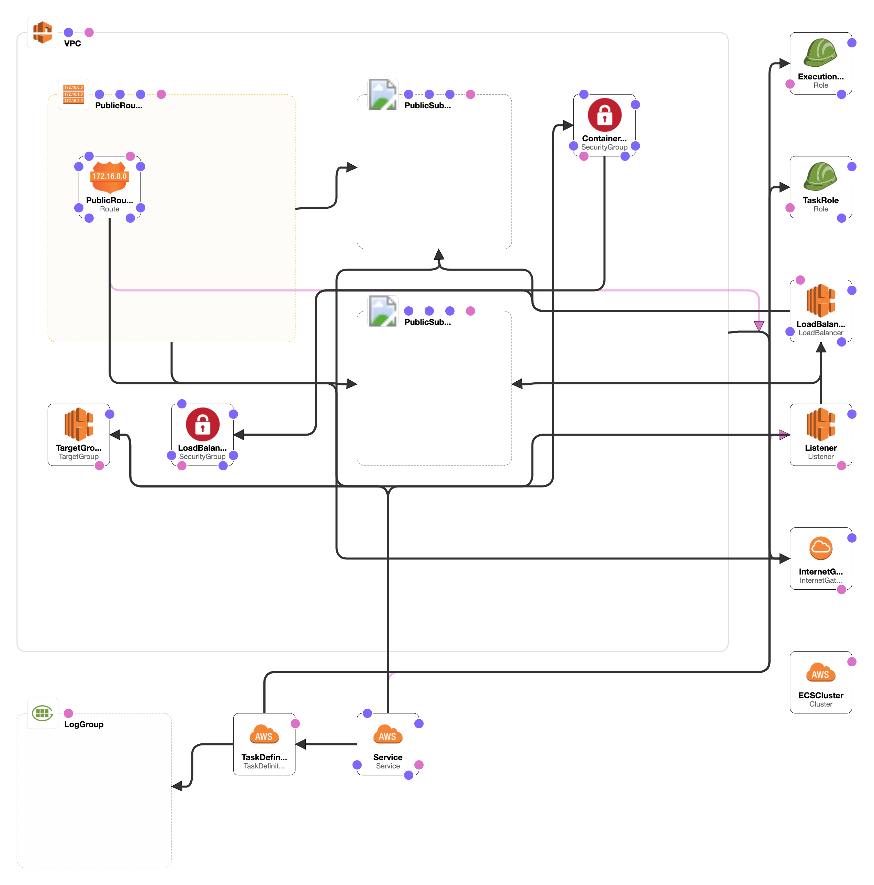

# energy_consumption 

Quick demo of querying a dynamodb with some meter readings and return results. This project uses Quarkus, the Supersonic Subatomic Java Framework.

If you want to learn more about Quarkus, please visit its website: https://quarkus.io/ .

## Running the application in dev mode

You can run your application in dev mode that enables live coding using:
```
./mvnw quarkus:dev
```

The api endpoints available are:
- localhost:8080/consumption/
- localhost:8080/consumption/customer/{customerid}/{date}
- localhost:8080/consumption/{date} [not implemented]

## Packaging and running the application

The application can be packaged using `./mvnw package`.
It produces the `energy_consumption-1.0-SNAPSHOT-runner.jar` file in the `/target` directory.
Be aware that it’s not an _über-jar_ as the dependencies are copied into the `target/lib` directory.

The application is now runnable using `java -jar target/energy_consumption-1.0-SNAPSHOT-runner.jar`.

## Creating a native executable

You can create a native executable using: `./mvnw package -Pnative`.

Or, if you don't have GraalVM installed, you can run the native executable build in a container using: `./mvnw package -Pnative -Dquarkus.native.container-build=true`.

You can then execute your native executable with: `./target/energy_consumption-1.0-SNAPSHOT-runner`

If you want to learn more about building native executables, please consult https://quarkus.io/guides/building-native-image.

## Deployment 
Provided your docker image is pushed to ECR, you can run the cloud formation template to spinup an ECS cluster(Fargate) and loadbalancer for your service.

Template  Variable  |  Description
------------------- |  -------------
ServiceName         |  A name for the service
ImageUrlBase        |  The url of a docker image
ContainerPort       |  port number docker container is binding to
ContainerCpu        |  Amount of CPU to allocate
ContainerMemory     |  amount of memory to allocate
Path                |  A path on the public load b
DesiredCount        |  Count of service task to run
    

    
##### Command:
    
    cd aws_resources
    aws cloudformation deploy \
    --capabilities CAPABILITY_NAMED_IAM \
    --template-file cloudformation.yml \
    --stack-name energy-consumption
    
The stack will create an ECS cluster with your application service, some networking with a load balancer. An 'A Record' will be  created which you can use to access the service.

### Assumptions
- container pushed to ecr for ecs consumption
- dynamodb with table called `rush`
- you have data persisted in Dynamodb in format:

         "meter": "1145",
         "date": "2019-01-02",
         "0:00": "9",
         "0:30": "6",
         "1:00": "12",
         "1:30": "4"
         
     meter and date are composite keys with additional columns as meter readings
     the api returns xyz

### ToDo
- build pipeline
- add test suite!!!
- clean and organize code
- implement collective usage for a date
- remove hardcoded values - use properties instead
- api documentation (javadocs)
- design document/ADRs -  fix design diagram(too mushy)
- healthcheck
- logging
- telemetry 
- Refine Security (network, application, IAM roles)
- get quarkus image working(trouble with graavlm native-image installation)
- immutable infrastructure [stack deletes are buggy]